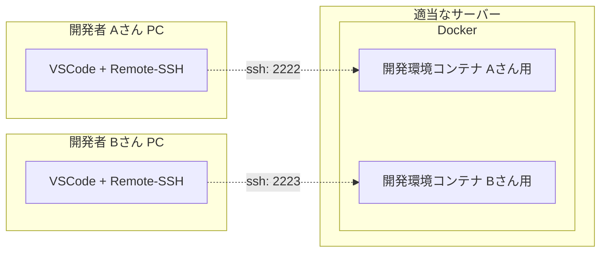
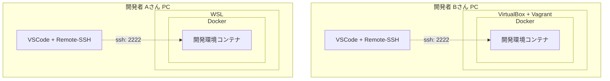
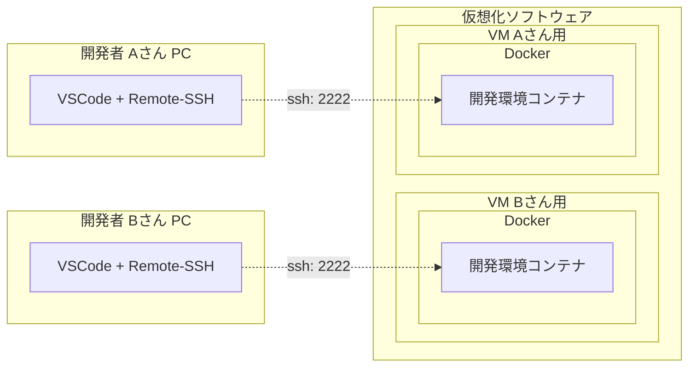

# rust_dev_docker_almalinux8_vscode

## 実験中
* VSCode 内蔵するぞ
* rust 版

Tauri  
https://v2.tauri.app/start/  

```
cargo install create-tauri-app --locked
cargo create-tauri-app
```

```
warning: be sure to add `/opt/dev-tools/cargo/bin:/opt/dev-tools/rustup/bin` to your PATH to be able to run the installed binaries
```

```
ssh user@192.168.56.10 -p2222 -L 8000:127.0.0.1:8000 -L 5000:127.0.0.1:5000
```

```
docker compose exec dev bash
```

```
$ curl --proto '=https' --tlsv1.2 -sSf https://sh.rustup.rs | sh
info: downloading installer

Welcome to Rust!
Rustへようこそ！

This will download and install the official compiler for the Rust
programming language, and its package manager, Cargo.
これにより、Rustプログラミング言語の公式コンパイラと、
そのパッケージマネージャであるCargoがダウンロードおよびインストールされます。

Rustup metadata and toolchains will be installed into the Rustup
home directory, located at:
Rustupのメタデータおよびツールチェーンは、Rustupのホームディレクトリに
インストールされます。このディレクトリの場所は以下の通りです:

  /home/user/.rustup

This can be modified with the RUSTUP_HOME environment variable.
これは、RUSTUP_HOME 環境変数で変更できます。

The Cargo home directory is located at:
Cargoのホームディレクトリは以下の場所にあります:

  /home/user/.cargo

This can be modified with the CARGO_HOME environment variable.
これは、CARGO_HOME 環境変数で変更できます。

The cargo, rustc, rustup and other commands will be added to
Cargo's bin directory, located at:
cargo、rustc、rustup およびその他のコマンドは、以下の場所にある
Cargoのbinディレクトリに追加されます:

  /home/user/.cargo/bin

This path will then be added to your PATH environment variable by
modifying the profile files located at:

  /home/user/.profile
  /home/user/.bash_profile
  /home/user/.bashrc

You can uninstall at any time with rustup self uninstall and
these changes will be reverted.
このパスは、以下の場所にあるプロファイルファイルを変更することで、
PATH 環境変数に追加されます:

Current installation options:


   default host triple: x86_64-unknown-linux-gnu
     default toolchain: stable (default)
               profile: default
  modify PATH variable: yes

1) Proceed with standard installation (default - just press enter)
2) Customize installation
3) Cancel installation
```
source ./bashrc
rust-lang.rust-analyzer-0.3.2129-linux-x64
sudo yum install gcc

```
cargo new hello_cargo
cd hello_cargo
cargo run
```

```
wget 'https://code.visualstudio.com/sha/download?build=stable&os=cli-alpine-x64' -O vscode_cli.tar.gz
tar -xf vscode_cli.tar.gz
```
x64 の Linux は cli-alpine-x64 しか選択肢が無いっぽい？
https://code.visualstudio.com/sha でリストが見れる  

```
$ ./code --version
code 1.93.1 (commit 38c31bc77e0dd6ae88a4e9cc93428cc27a56ba40)
```
```
code serve-web --help
```


```
$ code serve-web --help
Runs a local web version of Visual Studio Code

Usage: code-tunnel serve-web [OPTIONS]

Options:
      --host <HOST>
          Host to listen on, defaults to 'localhost'
      --socket-path <SOCKET_PATH>
          
      --port <PORT>
          Port to listen on. If 0 is passed a random free port is picked [default: 8000]
      --connection-token <CONNECTION_TOKEN>
          A secret that must be included with all requests
      --connection-token-file <CONNECTION_TOKEN_FILE>
          A file containing a secret that must be included with all requests
      --without-connection-token
          Run without a connection token. Only use this if the connection is secured by other means
      --accept-server-license-terms
          If set, the user accepts the server license terms and the server will be started without a user prompt
      --server-base-path <SERVER_BASE_PATH>
          Specifies the path under which the web UI and the code server is provided
      --server-data-dir <SERVER_DATA_DIR>
          Specifies the directory that server data is kept in
      --user-data-dir <USER_DATA_DIR>
          Specifies the directory that user data is kept in. Can be used to open multiple distinct instances of Code
      --extensions-dir <EXTENSIONS_DIR>
          Set the root path for extensions
  -h, --help
          Print help

GLOBAL OPTIONS:
      --cli-data-dir <CLI_DATA_DIR>  Directory where CLI metadata should be stored [env: VSCODE_CLI_DATA_DIR=]
      --verbose                      Print verbose output (implies --wait)
      --log <level>                  Log level to use [possible values: trace, debug, info, warn, error, critical, off]
```

```
./code serve-web --without-connection-token
```

```
./code serve-web --without-connection-token --host 0.0.0.0
```

```
ssh user@localhost -p2222 -L 8000:127.0.0.1:8000
```
bind [127.0.0.1]:8000: Permission denied
/etc/ssh/sshd_config
AllowTcpForwarding が yes になっているか確認

VSCode 組み込みのポート転送は使えないっぽい？
ssh で接続してポート転送した方がいいかも

* Git のアイコンに定期的に時計マークが表示されて煩わしい
* デフォルトで自動保存の設定: 「Auto Save」が有効になっている（編集したそばから保存されていく）  
  →　dotnet watch と相性が悪い
* WPF の XAML がビルドするまでエラーを吐き続ける　※プロジェクトのエラーがポップし続ける

dotnet watch --project ExampleApp.Web --urls "http://127.0.0.1:5000"
ssh user@localhost -p2222 -L 8000:localhost:8000 -L 5000:localhost:5000

### 参考
* サーバー上のVS Codeでリモート開発　tunnelとserve-web  
  https://shugomatsuzawa.com/techblog/2024/02/27/351/

## 概要
* .NET の開発環境を Docker で構築する
* VSCode の Remote-SSH で接続して開発する

### その他
* 素の AlmaLinux8 をベースにし、プロジェクトに合わせて変更しやすいようにする
* 一般ユーザーを追加し、sudo が使えるようにする

## 想定する利用方法
開発者は自分の端末に VSCode、Remote-SSH だけインストールし、Docker 上に構築した開発環境コンテナに SSH で接続して開発する。

Docker の構築については以下参照。  
なお、以下の例で言うと A さん B さんで異なる方法でも良い。  

### 実現方法例１）適当なサーバー内の Docker に開発者分コンテナを立てる
* コンテナの管理は代表者が行う
* 開発環境の更新など、コンテナの管理を代表者が行いやすい
* ポート管理がだるい



### 実現方法例２）各自の Docker で自分のコンテナは自分で立てる
* コンテナの管理は各自で行う
* サーバーを別途用意しなくてよい
* 開発者のレベルによって代表者の負担が増える
* 代表者がリモートで対応しづらい



### 実現方法例３）各自に Docker 入りの VM を提供し、自分のコンテナは自分で立てる
* １）と２）の良いとこ取りだが、サーバーの準備が一番面倒。メモリなどのリソースも一番食う
* ただし、開発プロジェクトは一つでは無いので、他のプロジェクトでも Docker を前提に開発環境を構築するなら、開発者に Docker 環境を提供しておいた方が良い
* VM であれば仮に開発者が Docker 環境を破壊しても再構築できるし、リモートで中の状態も確認しやすい



## 留意事項
* データが保持されるのは `/home` 内のファイルのみです。  
  ※他のフォルダのデータは、コンテナを破棄すると同時に破棄されます。
* 開発中のソースコードなどは、上記フォルダ内に配置してください。  
  ※`/home/${USER_NAME}` 内に配置されることを想定しています。  

## 使い方

### 起動
1. `.env` ファイルを作成
   ```
   cp .env.template .env
   ```
1. 必要に応じて `.env` ファイルの設定を変更  
   ※最低でも `SSH_PORT` は他と重複しないよう調整してください。
1. 起動
   ```
   docker compose up -d
   ```
1. VSCode の Remote-SSH で接続して好きに開発

### 停止
```
docker compose stop
```

### 再開
```
docker compose start
```

### 破棄　※`/home` のデータは🟢維持
```
docker compose down
```

### 破棄　※`/home` のデータも❌破棄
```
docker compose down -v
```

### 再構築　※`/home` のデータは🟢維持
* 環境がおかしくなったので初期化したい場合
* `.env` `Dockerfile` `compose.yml` など環境を変更したので適用したい場合

#### 手順
1. 現在のコンテナを破棄　※`/home` のデータは🟢維持  
   ```
   docker compose down
   ```
1. コンテナをビルド  
   ```
   docker compose build
   ```
1. コンテナを起動
   ```
   docker compose up -d
   ```

## トラブルシューティング

### ログ確認
```
docker compose logs
```

### 直接中の状態を確認　※コンテナ起動中のみ
```
docker compose exec dev bash
```

    const URL_VSIX_PATTERN = '
    
VisualStudio Marketplace - Visual Studio Code > Programming Languages > C# 
https://marketplace.visualstudio.com/items?itemName=ms-dotnettools.csharp

* 末尾の `itemName=` 以降を取得　→　`ms-dotnettools.csharp`
* ドットで分割する。前が publisher 後ろが extension
* Version History でダウンロードしたバージョンを確認　→　2.49.25

```
publisher=ms-dotnettools
extension=csharp
version=2.49.25
wget "https://marketplace.visualstudio.com/_apis/public/gallery/publishers/${publisher}/vsextensions/${extension}/${version}/vspackage" -O "${publisher}.${extension}-${version}.vsix"
wget "https://marketplace.visualstudio.com/_apis/public/gallery/publishers/${publisher}/vsextensions/${extension}/${version}/vspackage" -O /tmp/vspackage.gzip

7z x /tmp/vspackage.gzip -o/tmp/
7z x -so /tmp/vspackage.gzip | 7z x -si -tzip -ovspackage

wget "https://marketplace.visualstudio.com/_apis/public/gallery/publishers/ms-dotnettools/vsextensions/csharp/2.49.25/vspackage" -O /tmp/vspackage.gzip
gunzip -c /tmp/vspackage.gzip > /tmp/vspackage.zip
unzip /tmp/vspackage.zip "extension/*" -d vspackage
mv /tmp/vspackage/extension /vscode/extensions/ms-dotnettools.csharp-2.49.25-linux-x64

unzip /tmp/vspackage.zip -d vspackage

/tmp/vspackage/extension /vscode/extensions/ms-dotnettools.csharp-2.49.25-linux-x64

mv /tmp/vspackage/extension /vscode/extensions/ms-dotnettools.csharp-2.49.25-linux-x64


gunzip -c /tmp/vspackage.gzip | unzip - -d vspackage
gunzip -c /tmp/vspackage.gzip | unzip - "extension/*" -d vspackage
gunzip -c /tmp/vspackage.gzip | unzip - "extension/*" -d vspackage

ms-dotnettools.csharp-2.49.25-linux-x64  ms-dotnettools.vscode-dotnet-runtime-2.1.7

http://localhost:8000/

```
Unable to find extension target platform - no vsix manifest file exists at /vscode/extensions/ms-dotnettools.csharp-2.45.25-linux-x64/.vsixmanifest
Using dotnet configured on PATH
Dotnet path: /usr/local/share/dotnet/dotnet
Activating C# standalone...
waiting for named pipe information from server...
[Error - 2:56:17 PM] Microsoft.CodeAnalysis.LanguageServer client: couldn't create connection to server.
Error: Timeout. Client cound not connect to server via named pipe
	at W.<anonymous> (/vscode/extensions/ms-dotnettools.csharp-2.45.25-linux-x64/dist/extension.js:2:1265571)
	at Generator.next (<anonymous>)
	at s (/vscode/extensions/ms-dotnettools.csharp-2.45.25-linux-x64/dist/extension.js:2:1253516)
```

```
sudo dnf install p7zip p7zip-plugins
要7zip
gzip -> zip -> extension フォルダをリネームして /vscode/extensions に配置
```

```
How to download the .vsix file for older versions? #20184
https://github.com/microsoft/vscode-python/discussions/20184
> ?targetPlatform=linux-x64
> Valid targets: win32-x64, win32-arm64, linux-x64, linux-arm64, linux-armhf, darwin-x64, darwin-arm64, alpine-x64, alpine-arm64, web


```
https://marketplace.visualstudio.com/_apis/public/gallery/publishers/${publisher}/vsextensions/${extension}/${version}/vspackage
```

https://marketplace.visualstudio.com/_apis/public/gallery/publishers/ms-python/extensions/python/latest/vspackage

wget "https://marketplace.visualstudio.com/_apis/public/gallery/publishers/ms-python/extensions/python/latest/vspackage" -O ms-python-python.vsix
      https://marketplace.visualstudio.com/items?itemName=ms-dotnettools.csharp

$download_url = "http://${publisher}.gallery.vsassets.io/_apis/public/gallery/publisher/${publisher}/extension/${extensionname}/${version}/assetbyname/Microsoft.VisualStudio.Services.VSIXPackage"
